# 🃏 **BLACKJACK BALATRO STYLE** 🎰
#### *The Ultimate Retro Casino Experience* ✨

<div align="center">
  


<p>
  
  
  
  
</p>

<h2>🎮 Un juego de Blackjack inmersivo con diseño retro futurista</h2>


</div>

---

## 🌟 **CARACTERÍSTICAS PRINCIPALES**

<table>
<tr>
<td width="50%">

### 🎨 **DISEÑO VISUAL**
- 🌈 **Tema Balatro Inspirado** con colores vibrantes
- 🎭 **Interfaz Retro-Futurista** con efectos de neón
- ✨ **Animaciones Fluidas** en cartas y fichas
- 📱 **Completamente Responsive** para todos los dispositivos
- 🎪 **Efectos Visuales Impactantes** con gradientes y sombras

</td>
<td width="50%">

### 🔊 **EXPERIENCIA SONORA**
- 🎵 **Efectos de Sonido Inmersivos**
  - 🃏 Sonidos de cartas al repartir
  - 🪙 Efectos de fichas al apostar
  - 🎊 Sonidos de victoria/derrota
  - 🔘 Feedback auditivo de botones
- 🔇 **Control de Audio** personalizable

</td>
</tr>
</table>

---

## 🚀 **FUNCIONALIDADES AVANZADAS**

```mermaid
graph TD
    A[🎮 BLACKJACK GAME] --> B[🎲 Mecánicas Clásicas]
    A --> C[📊 Sistema de Estadísticas]
    A --> D[🎓 Tutorial Interactivo]
    A --> E[⚙️ Configuraciones]
    
    B --> B1[🃏 Hit/Stand/Double]
    B --> B2[✂️ Split de Cartas]
    B --> B3[🛡️ Seguro contra Blackjack]
    B --> B4[🎯 21 Perfecto]
    
    C --> C1[📈 Racha de Victorias]
    C --> C2[💰 Ganancias Totales]
    C --> C3[🎊 Blackjacks Conseguidos]
    C --> C4[📊 Porcentaje de Victoria]
    
    D --> D1[📚 Guía Paso a Paso]
    D --> D2[🎯 Resaltado Interactivo]
    D --> D3[💡 Consejos y Trucos]
    
    E --> E1[🔊 Control de Audio]
    E --> E2[⚡ Velocidad de Animación]
    E --> E3[🤖 Auto-Continuar]
    E --> E4[💡 Mostrar Consejos]
```

<div align="center">



</div>

---

## 🎯 **MECÁNICAS DE JUEGO**

<div align="center">

| 🎮 **ACCIÓN** | 🎯 **DESCRIPCIÓN** | 🎲 **REGLA** |
|:---:|:---:|:---:|
| 🃏 **Hit** | Pedir otra carta | Súmate a 21 sin pasarte |
| ✋ **Stand** | Plantarse con cartas actuales | Conserva tu puntuación |
| 2️⃣ **Double** | Doblar apuesta y recibir 1 carta | Solo con 2 cartas iniciales |
| ✂️ **Split** | Dividir cartas iguales | Crea dos manos separadas |
| 🛡️ **Insurance** | Seguro contra Blackjack dealer | Cuando dealer muestra As |

</div>

### 🃏 **VALORES DE CARTAS**
```
┌─────────────────────────────────────────────────────────┐
│  🂡 As = 1 ó 11    🂺🂻🂽🂾 Figuras = 10    🂢🂣...🂩 Números = Valor  │
└─────────────────────────────────────────────────────────┘
```

---

## 🎰 **SISTEMA DE APUESTAS**

<div align="center">

### 💰 **FICHAS DISPONIBLES**

<table>
<tr>
<td align="center">
<br>
<strong>$5</strong><br>
<em>Púrpura</em>
</td>
<td align="center">
<br>
<strong>$25</strong><br>
<em>Verde</em>
</td>
<td align="center">
<br>
<strong>$100</strong><br>
<em>Rojo</em>
</td>
<td align="center">
<br>
<strong>$500</strong><br>
<em>Dorado</em>
</td>
</tr>
</table>

</div>

---

## 📊 **PANTALLA DE BIENVENIDA**

<div align="center">

### 🎪 **ESTADÍSTICAS EN TIEMPO REAL**


</div>

**Características de la Pantalla Principal:**
- 🎮 **Partidas Jugadas** - Contador total de juegos
- 🔥 **Mejor Racha** - Tu racha de victorias consecutivas más alta
- 💎 **Ganancias Totales** - Dinero ganado acumulado
- 🎓 **Tutorial Interactivo** - Aprende jugando
- ⚙️ **Configuraciones Personalizables** - Ajusta tu experiencia

---

## 🎨 **PALETA DE COLORES**

<div align="center">

<table>
<tr>
<td align="center" bgcolor="#111712">
<strong style="color: white;">🌑 Fondo Principal</strong><br>
<code>#111712</code>
</td>
<td align="center" bgcolor="#1d1f2b">
<strong style="color: white;">🎭 Superficie</strong><br>
<code>#1d1f2b</code>
</td>
<td align="center" bgcolor="#31343f">
<strong style="color: white;">🔘 Acentos</strong><br>
<code>#31343f</code>
</td>
<td align="center" bgcolor="#e2b53c">
<strong style="color: black;">✨ Dorado</strong><br>
<code>#e2b53c</code>
</td>
<td align="center" bgcolor="#d33946">
<strong style="color: white;">❤️ Resaltado</strong><br>
<code>#d33946</code>
</td>
</tr>
</table>

</div>

---

## 🚀 **INSTALACIÓN Y USO**

### 📋 **Requisitos Previos**
```bash
✅ Navegador Web Moderno (Chrome, Firefox, Safari, Edge)
✅ JavaScript Habilitado  
✅ Conexión a Internet (para fuentes de Google)
```

### 🛠️ **Instalación Rápida**

```bash
# 1️⃣ Clona el repositorio
git clone https://github.com/tuusuario/blackjack-balatro-style.git

# 2️⃣ Navega al directorio
cd blackjack-balatro-style

# 3️⃣ Abre el juego en tu navegador
open index.html
# o simplemente haz doble clic en index.html
```

### 🌐 **Estructura de Archivos**

```
🃏 blackjack-balatro-style/
├── 📄 index.html          # Página principal del juego
├── 🎨 style.css           # Estilos y animaciones
├── ⚡ script.js           # Lógica del juego
├── 📁 assets/
│   ├── 🎵 sounds/         # Efectos de sonido
│   │   ├── 🔊 win.mp3
│   │   ├── 😢 lose.mp3
│   │   ├── 🤝 push.mp3
│   │   ├── 🪙 chip_stack.mp3
│   │   ├── 🃏 card_deal.mp3
│   │   ├── 🔄 card_flip.mp3
│   │   └── 🔘 button.mp3
│   └── 🃏 cards/          # Imágenes de cartas
│       ├── ♠️ spades_*.svg
│       ├── ❤️ hearts_*.svg
│       ├── ♦️ diamonds_*.svg
│       ├── ♣️ clubs_*.svg
│       └── 🎭 back.svg
└── 📖 README.md           # Este archivo
```

---

## 🎮 **CÓMO JUGAR**

<div align="center">

### 🎯 **GUÍA RÁPIDA**

```
┌─────────────────────────────────────────────────────────────┐
│  1️⃣  Haz clic en las fichas para apostar                     │
│  2️⃣  Presiona "Deal" para repartir cartas                   │  
│  3️⃣  Usa "Hit" para pedir cartas o "Stand" para plantarte  │
│  4️⃣  ¡Gana llegando a 21 o superando al dealer!           │
└─────────────────────────────────────────────────────────────┘
```

</div>

### 🏆 **CONDICIONES DE VICTORIA**

| 🎊 **RESULTADO** | 📝 **DESCRIPCIÓN** | 💰 **PAGO** |
|:---:|:---:|:---:|
| 🃏 **Blackjack** | As + Figura (21 con 2 cartas) | **3:2** |
| 🎯 **Victoria Normal** | Más cerca de 21 que el dealer | **1:1** |
| 🤝 **Empate (Push)** | Misma puntuación que dealer | **Sin cambio** |
| 💥 **Bust** | Te pasaste de 21 | **Pierdes apuesta** |

---

## ⚙️ **CONFIGURACIONES AVANZADAS**

<div align="center">

### 🎛️ **OPCIONES PERSONALIZABLES**

<table>
<tr>
<td width="50%">

#### 🔊 **AUDIO**
- ✅ **Habilitar/Deshabilitar** efectos de sonido
- 🎵 **Control total** sobre la experiencia auditiva
- 🔇 **Modo silencioso** para jugar discretamente

#### ⚡ **ANIMACIONES**
- 🐌 **Lenta** - Para observar cada detalle
- 🚶 **Normal** - Experiencia balanceada
- 🏃 **Rápida** - Para jugadores expertos

</td>
<td width="50%">

#### 🤖 **AUTOMATIZACIÓN**
- 🔄 **Auto-continuar** después de cada mano
- 💡 **Mostrar consejos** para nuevos jugadores
- 🎯 **Resaltado de acciones** recomendadas

#### 📊 **ESTADÍSTICAS**
- 📈 **Seguimiento completo** de tu progreso
- 🔥 **Rachas de victoria** y análisis de rendimiento
- 💰 **Historial de ganancias** y balance máximo

</td>
</tr>
</table>

</div>

---

## 🎓 **TUTORIAL INTERACTIVO**

<div align="center">


</div>

### 📚 **7 PASOS PARA DOMINAR EL JUEGO**

```
1️⃣ 🎪 Bienvenida → Introducción al Blackjack
2️⃣ 🪙 Apuestas → Cómo usar las fichas  
3️⃣ 🃏 Repartir → Iniciando una nueva mano
4️⃣ ⚡ Acciones → Hit, Stand, Double, Split
5️⃣ 🏆 Victoria → Condiciones para ganar
6️⃣ 💰 Balance → Gestión de tu dinero
7️⃣ 🎯 ¡Listo! → ¡Empieza a jugar!
```

---

## 📱 **COMPATIBILIDAD**

<div align="center">

### 🌐 **NAVEGADORES SOPORTADOS**

<table>
<tr>
<td align="center">
<br>
<strong>✅ Chrome 90+</strong>
</td>
<td align="center">
<br>
<strong>✅ Firefox 88+</strong>
</td>
<td align="center">
<br>
<strong>✅ Safari 14+</strong>
</td>
<td align="center">
<br>
<strong>✅ Edge 90+</strong>
</td>
</tr>
</table>

### 📱 **DISPOSITIVOS**

| 💻 **Desktop** | 📱 **Móvil** | 📱 **Tablet** |
|:---:|:---:|:---:|
| ✅ Completamente optimizado | ✅ Interfaz táctil responsiva | ✅ Experiencia adaptada |
| 🖱️ Controles con mouse | 👆 Gestos táctiles intuitivos | 🔄 Rotación automática |

</div>

---

## 🎨 **CAPTURAS DE PANTALLA**

<div align="center">

### 🎮 **PANTALLA PRINCIPAL DE JUEGO**


### 📊 **PANTALLA DE ESTADÍSTICAS**


### ⚙️ **PANEL DE CONFIGURACIÓN**


</div>

---

## 🔧 **TECNOLOGÍAS UTILIZADAS**

<div align="center">

<table>
<tr>
<td align="center" width="25%">
<br>
<strong>HTML5</strong><br>
<em>Estructura semántica</em>
</td>
<td align="center" width="25%">
<br>
<strong>CSS3</strong><br>
<em>Estilos modernos y animaciones</em>
</td>
<td align="center" width="25%">
<br>
<strong>JavaScript ES6+</strong><br>
<em>Lógica del juego</em>
</td>
<td align="center" width="25%">
<br>
<strong>SVG Graphics</strong><br>
<em>Gráficos vectoriales</em>
</td>
</tr>
</table>

### 🎯 **CARACTERÍSTICAS TÉCNICAS DESTACADAS**

```javascript
// ✨ Características modernas implementadas
const features = {
    🎨 animations: "CSS3 Keyframes + Transitions",
    🔊 audio: "Web Audio API",
    💾 storage: "LocalStorage para persistencia", 
    📱 responsive: "CSS Grid + Flexbox",
    🎭 theme: "CSS Custom Properties",
    ⚡ performance: "Optimización de DOM"
};
```

</div>

---

## 🤝 **CONTRIBUIR**

<div align="center">

### 🎯 **¿QUIERES CONTRIBUIR?**

¡Las contribuciones son bienvenidas! Aquí hay algunas formas de ayudar:

</div>

#### 🐛 **REPORTAR BUGS**
- 🔍 Busca en issues existentes
- 📝 Describe el problema detalladamente  
- 🎮 Incluye pasos para reproducir
- 📸 Adjunta capturas de pantalla

#### ✨ **NUEVAS CARACTERÍSTICAS**
- 💡 Propón nuevas ideas en issues
- 🛠️ Haz fork del repositorio
- 🎨 Implementa tu característica
- 📤 Envía un pull request

#### 🎨 **MEJORAS DE DISEÑO**
- 🌈 Nuevos temas de colores
- ✨ Animaciones mejoradas
- 📱 Optimizaciones móviles
- 🎭 Efectos visuales

---

## 📄 **LICENCIA**

<div align="center">


```
MIT License - Libre para usar, modificar y distribuir
```

**¡Siéntete libre de usar este proyecto como base para tus propias creaciones!**

</div>

---

## 👤 **AUTOR**

<div align="center">

### 🎭 **DESARROLLADO CON** ❤️

**¿Te gustó el proyecto?** ⭐ **¡Dale una estrella al repositorio!**

<p>


</p>

---

### 🎰 **¡DISFRUTA JUGANDO BLACKJACK!** 🃏


</div>

---

<div align="center">
<sub>Hecho con 🃏 y mucho ☕ | © 2024 Blackjack Balatro Style</sub>
</div> 